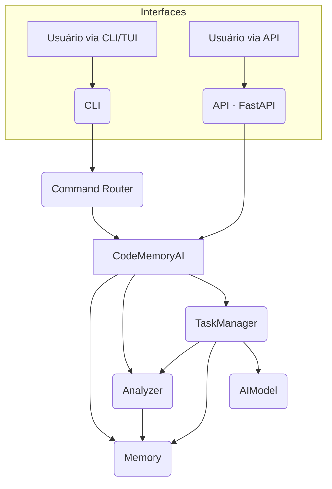

# Arquitetura do DevAI

Este documento resume a função de cada módulo do diretório `devai/` e como a API, a CLI e o gerenciador de tarefas se integram.

## Visão geral

O núcleo da aplicação é a classe `CodeMemoryAI` em `core.py`. Ela coordena a **memória**, a **análise de código** e a **execução de tarefas**. A API e a CLI utilizam essa instância para expor as funcionalidades ao usuário.

### Principais módulos

- `__init__.py` – inicializa o pacote.
- `__main__.py` – ponto de entrada para `python -m devai` e seleção de modo (API, CLI ou TUI).
- `ai_model.py` – comunicação segura com o modelo de linguagem.
- `analyzer.py` – análise do código do projeto e grafo de dependências.
- `api_schemas.py` – modelos Pydantic usados pela API.
- `approval.py` – fila de solicitações de aprovação.
- `auto_review.py` – geração de revisões automáticas.
- `cli.py` – interface de linha de comando baseada em Rich.
- `command_router.py` – roteamento dos comandos da CLI.
- `complexity_tracker.py` – registro histórico da complexidade do projeto.
- `config.py` – carregamento de configuração e logger.
- `conversation_handler.py` – gerenciamento de múltiplas sessões de conversa.
- `core.py` – orquestrador principal e servidor FastAPI.
- `decision_log.py` – armazenamento de decisões aprovadas.
- `dependency_check.py` – verificação de dependências obrigatórias.
- `dialog_summarizer.py` – sumarização de diálogos longos.
- `error_handler.py` – persistência de erros.
- `feedback.py` – registro de feedback para RLHF.
- `file_history.py` – controle de histórico de arquivos editados.
- `intent_classifier.py` – classificador de intenções do usuário.
- `intent_router.py` – despacho de comandos conforme a intenção.
- `learning_engine.py` – consolidação de lições aprendidas.
- `lint.py` – verificação rápida de TODOs e afins.
- `log_monitor.py` – monitoramento de logs de execução.
- `memory.py` – base vetorial de memórias e busca.
- `metacognition.py` – avaliação contínua de desempenho.
- `monitor_engine.py` – ciclo de monitoramento automático.
- `notifier.py` – envio opcional de notificações.
- `patch_utils.py` – utilidades para aplicar patches.
- `unidiff/` – parser minimalista para patches unificados.
- `plugin_manager.py` – carregamento de plugins externos.
- `prompt_engine.py` – construção dinâmica de prompts.
- `prompt_utils.py` – funções auxiliares para prompts.
- `rlhf.py` – rotina de fine‑tuning por feedback.
- `sandbox.py` – execução isolada de comandos.
- `shadow_mode.py` – simulação de alterações sem aplicar.
- `symbolic_memory_tagger.py` – marcação simbólica de memórias.
- `symbolic_training.py` – treinamento a partir de regras simbólicas.
- `symbolic_verification.py` – verificação de invariantes simbólicos.
- `tasks.py` – gerenciador de tarefas automatizadas.
- `test_runner.py` – executor de testes do projeto.
- `tui.py` – interface textual opcional.
- `ui.py` – pequena interface web.
- `update_manager.py` – aplicação de mudanças com rollback.

### Integração entre API, CLI e tarefas

- **API**: o modo `--api` inicializa o servidor FastAPI definido em `core.py`. Os endpoints permitem analisar código, manipular arquivos, consultar métricas e executar tarefas específicas.
- **CLI/TUI**: os modos `--cli` e `--cli --tui` chamam `cli.py`, que utiliza o `command_router.py` para traduzir comandos do usuário em chamadas ao `CodeMemoryAI`.
- **Gerenciador de tarefas**: `tasks.py` encapsula rotinas como execução de testes, lint e análise estática. Tanto a API quanto a CLI podem disparar tarefas através do `TaskManager` presente em `core.py`.

### Fluxo principal

As interfaces consomem os mesmos serviços internos, garantindo comportamento consistente independentemente do ponto de acesso.
